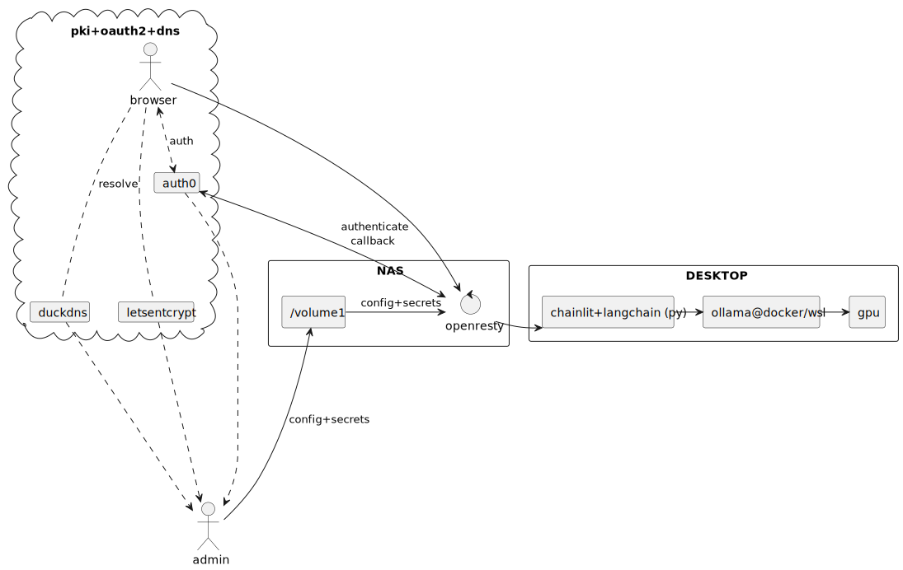

# Poor mans ai backend

This repo documents a minimal setup to host chat-gpt-like app using home hardware, built to be [accessible externally via web](https://github.com/diemenator/auth0-gateway-on-home-nas) for personal use.

It uses LangChain as base boilerplate for MCP extendability and refined workflow building.

It uses ChainLit (python) to host web ui and route user prompts to LangChain-built workflows.

Chat history persistance has been added later to use externally hosted postgres server.



## Running

```bash
# setup venv and install pip upgrade & dependencies into it
python3.12 -m venv ./.venv
source ./.venv/bin/activate
python -m pip install --upgrade pip

# reactivate venv to force pick up latest pip version
deactivate
source ./.venv/bin/activate

# install dependencies with up to date resolvers
python -m pip install -r ./requirements.txt
```

```bash
# chainlit will run its asgi runtime and load main.py for bindings
chainlit run main.py --port 8080 --host 0.0.0.0
```

Tested with:
- backend - windows desktop gtx2070 on win10 + wsl2 + dockerCE
- web gateway - see https://github.com/diemenator/auth0-gateway-on-home-nas/blob/main/nginx/conf.d/default.conf

## Backend (ollama server + model downloads)

```
docker run -d --gpus=all -v "R:\docker-data\ollama:/root/.ollama:rw" -p 11434:11434 --name ollama ollama/ollama
```

Take note that its best to volume-map .ollama dir to have pulled models persisted accross runs.

Fetch a model you want to use (see main.py)

```
docker exec ollama pull gemma3:4b-it-qat
```

or from huggingface

```
docker exec ollama pull hf.co/reponame/modelname:tag
```

The actually used model is specified in the main.py

## Windows - external access to WSL 

If you happen to run docker on wsl2-enabled windows machine, here are extra steps to perform for networking setup.

Check iternal wsl IP address
```cmd
wsl hostname -I
;rem prints 192.168.55.237
```

Use it to setup reverse port proxy to enable host-to-wsl network access
```cmd
netsh interface portproxy add v4tov4 listenport=8080 listenaddress=0.0.0.0 connectport=8080 connectaddress=192.168.55.237
```

To diagnose existing port proxies
```cmd
netsh interface portproxy show all
```

To reset configuration
```cmd
netsh interface portproxy reset
```


